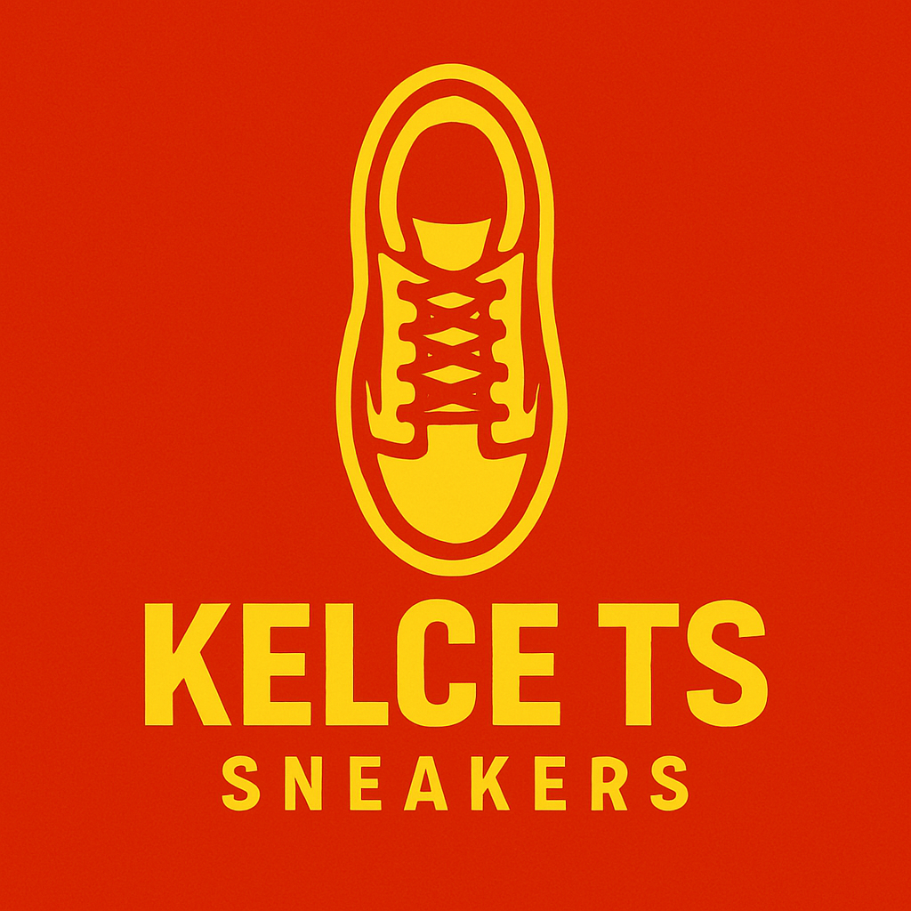

# KelceTS - More than sneakers. We are movement. 🏈✨

<div align="center">
  
  
  
  
  
  
  
  
  [](https://kelce-ts-landing.vercel.app)
  [](https://github.com/AraceliFradejas/KELSETSlanding)

  **A modern, Swiftie-inspired sneaker startup landing page with integrated AI assistant**

  [English](#english) | [Español](#español)
</div>

---

## English

### 🎯 Project Overview

KelceTS is a fictional innovative sneaker startup that combines the passion of **Travis Kelce** with the storytelling magic of **Taylor Swift**. This landing page showcases a modern, responsive web application featuring an integrated AI assistant powered by **Microsoft Copilot Studio**.

Born from a Swiftie moment in 2023 and evolved through AI projects, KelceTS represents the perfect fusion of sports, style, technology, and pop culture.

### ✨ Key Features

#### 🏠 **Landing Page**
- **Modern Hero Section** with video background and smooth animations
- **Company Values** showcase (Technology, Style, Trust, Culture)
- **Customer Testimonials** with real-time statistics
- **Responsive Design** optimized for all devices
- **Multilingual Support** (English/Spanish)

#### 🤖 **AI Assistant - tAilor**
- **Microsoft Copilot Studio** integration
- **Conversational AI** for customer support
- **24/7 Availability** with multilingual capabilities
- **Smooth Chat Interface** with expand/collapse functionality
- **European Union** language support

#### 📖 **Our Story Page**
- **Interactive Timeline** of KelceTS journey
- **Image Carousel** featuring Taylor Swift Eras Tour moments
- **Embedded YouTube Videos** showcasing AI projects
- **Swiftie References** throughout the storytelling
- **Bilingual Content** with smooth translations

#### 🎨 **Design & UX**
- **Swift-inspired** color palette (Chiefs Red + Lavender)
- **Smooth Scroll Animations** and hover effects
- **Mobile-First Responsive** design
- **Accessibility Optimized** navigation
- **SEO Friendly** structure

### 🛠️ Tech Stack

| Technology | Purpose |
|------------|---------|
| **React 18** | Frontend framework |
| **Vite** | Build tool and dev server |
| **React Router** | Client-side routing |
| **Tailwind CSS** | Styling and responsive design |
| **Microsoft Copilot Studio** | AI assistant integration |
| **Vercel** | Deployment and hosting |
| **ESLint** | Code linting |

### 🚀 Live Demo

Visit the live application: **[https://kelce-ts-landing.vercel.app](https://kelce-ts-landing.vercel.app)**

### 📁 Project Structure

```
KELSETSlanding/
├── public/
│   ├── KelceTS_logo.png
│   ├── taylor0-4.jpg/avif/jpeg    # Taylor Swift images
│   ├── kelce1.avif                 # Key moment image
│   └── video/                      # Background videos
├── src/
│   ├── components/
│   │   ├── Header.jsx              # Navigation with tAilor button
│   │   ├── Hero.jsx                # Main landing section
│   │   ├── AIAssistant.jsx         # tAilor integration
│   │   ├── OurStory.jsx            # Story page component
│   │   ├── Values.jsx              # Company values
│   │   ├── Testimonials.jsx        # Customer feedback
│   │   ├── Contact.jsx             # Contact section
│   │   ├── Footer.jsx              # Site footer
│   │   └── ScrollToTop.jsx         # Route navigation utility
│   ├── data/
│   │   └── translations.js         # Bilingual content
│   ├── utils/
│   │   ├── animations.js           # Animation utilities
│   │   └── videoUtils.js           # Video management
│   ├── App.jsx                     # Main app component
│   └── main.jsx                    # Entry point
├── vercel.json                     # Deployment configuration
├── tailwind.config.js              # Tailwind configuration
└── package.json                    # Dependencies and scripts
```

### 🎬 Featured Content

#### **Timeline Highlights**
1. **October 2023** - The Swiftie origin story at Eras Tour movie
2. **May 2024** - The Ticketmaster "plot twist" that sparked KelceTS
3. **2024-2025** - AI projects evolution and Microsoft Power Up course

#### **Integrated Media**
- **YouTube Videos**: Kaggle Competition and Capstone Project showcases
- **Image Gallery**: Taylor Swift Eras Tour moments carousel
- **Background Video**: Dynamic hero section

### 🌐 Deployment

The application is automatically deployed to **Vercel** with:
- **Continuous Deployment** from main branch
- **Custom Domain** configuration ready
- **Performance Optimization** with Vite build
- **SPA Routing** support for React Router

### 🔧 Development Setup

1. **Clone the repository**
   ```bash
   git clone https://github.com/AraceliFradejas/KELSETSlanding.git
   cd KELSETSlanding
   ```

2. **Install dependencies**
   ```bash
   npm install
   ```

3. **Start development server**
   ```bash
   npm run dev
   ```

4. **Build for production**
   ```bash
   npm run build
   ```

### 🎯 Future Enhancements

- [ ] E-commerce integration
- [ ] Advanced AI assistant features
- [ ] User authentication
- [ ] Product catalog
- [ ] Shopping cart functionality
- [ ] Payment processing
- [ ] Customer dashboard

---

## Español

### 🎯 Descripción del Proyecto

KelceTS es una startup ficticia e innovadora de zapatillas que combina la pasión de **Travis Kelce** con la magia narrativa de **Taylor Swift**. Esta landing page presenta una aplicación web moderna y responsive con un asistente de IA integrado desarrollado con **Microsoft Copilot Studio**.

Nacido de un momento Swiftie en 2023 y evolucionado a través de proyectos de IA, KelceTS representa la fusión perfecta entre deporte, estilo, tecnología y cultura pop.

### ✨ Características Principales

#### 🏠 **Landing Page**
- **Sección Hero Moderna** con video de fondo y animaciones suaves
- **Valores de la Empresa** destacados (Tecnología, Estilo, Confianza, Cultura)
- **Testimonios de Clientes** con estadísticas en tiempo real
- **Diseño Responsive** optimizado para todos los dispositivos
- **Soporte Multiidioma** (Inglés/Español)

#### 🤖 **Asistente IA - tAilor**
- **Integración con Microsoft Copilot Studio**
- **IA Conversacional** para atención al cliente
- **Disponibilidad 24/7** con capacidades multiidioma
- **Interfaz de Chat Suave** con funcionalidad expandir/contraer
- **Soporte de idiomas** de la Unión Europea

#### 📖 **Página Nuestra Historia**
- **Timeline Interactivo** del viaje de KelceTS
- **Carrusel de Imágenes** con momentos del Eras Tour de Taylor Swift
- **Videos de YouTube Integrados** mostrando proyectos de IA
- **Referencias Swiftie** a lo largo de la narrativa
- **Contenido Bilingüe** con traducciones suaves

#### 🎨 **Diseño y UX**
- **Paleta de colores** inspirada en Swift (Chiefs Red + Lavender)
- **Animaciones de Scroll Suaves** y efectos hover
- **Diseño Responsive Mobile-First**
- **Navegación Optimizada** para accesibilidad
- **Estructura SEO Friendly**

### 🛠️ Stack Tecnológico

| Tecnología | Propósito |
|------------|-----------|
| **React 18** | Framework frontend |
| **Vite** | Herramienta de build y servidor dev |
| **React Router** | Enrutamiento del lado cliente |
| **Tailwind CSS** | Estilos y diseño responsive |
| **Microsoft Copilot Studio** | Integración asistente IA |
| **Vercel** | Despliegue y hosting |
| **ESLint** | Linting de código |

### 🚀 Demo en Vivo

Visita la aplicación en vivo: **[https://kelce-ts-landing.vercel.app](https://kelce-ts-landing.vercel.app)**

### 🎬 Contenido Destacado

#### **Hitos del Timeline**
1. **Octubre 2023** - La historia de origen Swiftie en la película del Eras Tour
2. **Mayo 2024** - El "plot twist" de Ticketmaster que generó KelceTS
3. **2024-2025** - Evolución de proyectos IA y curso Microsoft Power Up

#### **Media Integrado**
- **Videos de YouTube**: Showcases de Competición Kaggle y Proyecto Capstone
- **Galería de Imágenes**: Carrusel de momentos del Eras Tour de Taylor Swift
- **Video de Fondo**: Sección hero dinámica

### 🌐 Despliegue

La aplicación se despliega automáticamente en **Vercel** con:
- **Despliegue Continuo** desde la rama main
- **Configuración de Dominio Personalizado** lista
- **Optimización de Rendimiento** con build de Vite
- **Soporte de Enrutamiento SPA** para React Router

### 🔧 Configuración de Desarrollo

1. **Clonar el repositorio**
   ```bash
   git clone https://github.com/AraceliFradejas/KELSETSlanding.git
   cd KELSETSlanding
   ```

2. **Instalar dependencias**
   ```bash
   npm install
   ```

3. **Iniciar servidor de desarrollo**
   ```bash
   npm run dev
   ```

4. **Build para producción**
   ```bash
   npm run build
   ```

### 🎯 Mejoras Futuras

- [ ] Integración e-commerce
- [ ] Funciones avanzadas del asistente IA
- [ ] Autenticación de usuarios
- [ ] Catálogo de productos
- [ ] Funcionalidad de carrito de compras
- [ ] Procesamiento de pagos
- [ ] Dashboard de clientes

---

## 👩‍💻 Author / Autora

**Araceli Fradejas**
- 🎓 Master's in Business AI - Instituto Internacional de Analítica (IIA)
- 💼 AI Specialist & Full-Stack Developer
- 🎵 Proud Swiftie since October 13, 2023
- 🏈 Chiefs Kingdom member
- 🚀 Microsoft Power Up Program Graduate

### 🔗 Connect / Conecta

[](https://linkedin.com/in/araceli-fradejas)
[](https://github.com/AraceliFradejas)
[](https://medium.com/@araceli.fradejas)

---

## 📄 License / Licencia

This project is licensed under the MIT License - see the [LICENSE](LICENSE) file for details.

Este proyecto está licenciado bajo la Licencia MIT - consulta el archivo [LICENSE](LICENSE) para más detalles.

---

## 🙏 Acknowledgments / Agradecimientos

- **Taylor Swift** for the endless inspiration and the Eras Tour magic ✨
- **Travis Kelce** for being the perfect muse for this sports-meets-style concept 🏈
- **Microsoft Copilot Studio** for powering our AI assistant tAilor 🤖
- **The Swiftie Community** for understanding that everything is possible with a little bit of magic 💫

---

<div align="center">
  <p><strong>Made with ❤️ and a lot of ✨ Taylor Swift magic ✨</strong></p>
  <p><em>"Today, every challenge overcome and every app published sounds like a chorus of The Man, because although nobody bet on me... here I am, leading my own era."</em></p>
</div>

1. Clona el repositorio:
```bash
git clone https://github.com/tu-usuario/kelsets-landing.git
cd kelsets-landing
```

2. Instala las dependencias:
```bash
npm install
```

3. Inicia el servidor de desarrollo:
```bash
npm run dev
```

4. Abre tu navegador en `http://localhost:5173`

## 🏗️ Construcción para Producción

```bash
npm run build
```

Los archivos optimizados se generarán en la carpeta `dist/`.

## 🎨 Estilo Visual

- **Estética "Swifie"**: Moderna, juvenil y emocional
- **Paleta de Colores**: 
  - Coral: `#ff6b47` - `#ff8f6a`
  - Lavanda: `#9563ff` - `#b191ff`
  - Neutros: Blanco, negro, grises
- **Tipografía**: Outfit y Poppins
- **Animaciones**: FadeIn, SlideIn, Bounce effects

## 📱 Secciones

### 1. Header
- Logo de KelceTS
- Navegación por anclas
- Selector de idioma (🇺🇸 EN | 🇪🇸 ES)

### 2. Hero
- Video de fondo en autoplay
- Mensaje principal multiidioma
- Botones de llamada a la acción

### 3. Values (Valores)
- 4 pilares: Technology, Style, Trust, Culture
- Iconos personalizados
- Descripciones detalladas

### 4. Testimonials (Testimonios)
- 3 testimonios reales por idioma
- Calificaciones con estrellas
- Indicadores de confianza

### 5. AI Assistant (Asistente IA)
- Integración con Microsoft Copilot Studio
- Interfaz de chat simulada
- Características del asistente

### 6. Contact (Contacto)
- Formulario de contacto
- Información de la empresa
- Enlaces a redes sociales

### 7. Footer
- Enlaces organizados
- Newsletter signup
- Información legal

## 🔧 Configuración del Asistente IA

Para integrar tu asistente de Microsoft Copilot Studio:

1. Ve al archivo `src/components/AIAssistant.jsx`
2. Busca el comentario sobre la integración
3. Reemplaza el placeholder con tu iframe URL:

```jsx
<iframe 
  src="https://copilotstudio.microsoft.com/embed/your-agent-id" 
  className="w-full h-80 rounded-xl border-0" 
  title="KelceTS Assistant"
  allow="microphone"
/>
```

## 🌐 Deploy en GitHub Pages

1. Instala gh-pages:
```bash
npm install --save-dev gh-pages
```

2. Agrega el script de deploy en `package.json`:
```json
{
  "scripts": {
    "deploy": "gh-pages -d dist"
  }
}
```

3. Construye y despliega:
```bash
npm run build
npm run deploy
```

## 📋 Personalización

### Cambiar Colores
Edita el archivo `tailwind.config.js` para personalizar la paleta de colores.

### Agregar Contenido
Modifica el archivo `src/data/translations.js` para actualizar textos en ambos idiomas.

### Modificar Animaciones
Las animaciones se definen en `src/index.css` y se pueden personalizar según tus necesidades.

## 🤝 Contribución

1. Fork el proyecto
2. Crea una rama para tu feature (`git checkout -b feature/AmazingFeature`)
3. Commit tus cambios (`git commit -m 'Add some AmazingFeature'`)
4. Push a la rama (`git push origin feature/AmazingFeature`)
5. Abre un Pull Request

## 📄 Licencia

Este proyecto está bajo la Licencia MIT. Ve el archivo `LICENSE` para más detalles.

## 📞 Contacto

KelceTS S.L. - [@kelcets](https://twitter.com/kelcets) - hello@kelcets.com

Link del Proyecto: [https://github.com/tu-usuario/kelsets-landing](https://github.com/tu-usuario/kelsets-landing)

---

Made with ❤️ by KelceTS Team
